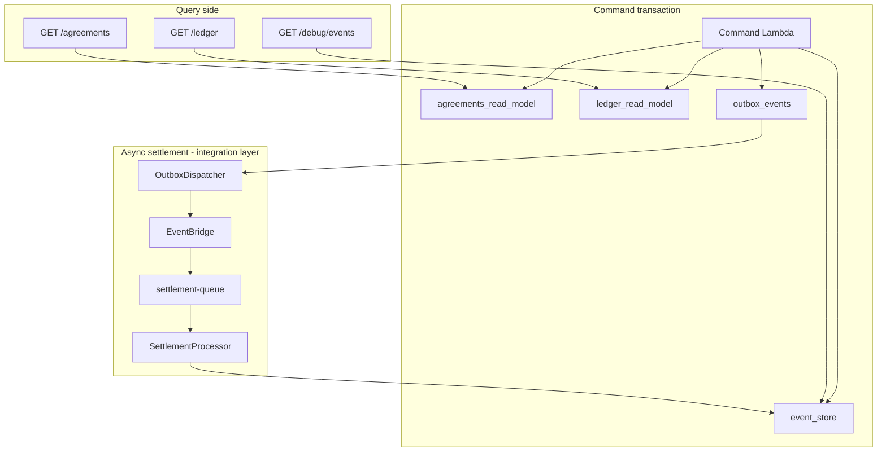

# Architecture

Event-sourced CQRS agreement workflow. Source of truth: [`event_store`](../db/migrations/1780600000000_event_sourced_baseline.js). Read models are derived projections, not authoritative.

For setup and demo walkthrough, see [README](../README.md).

## Write and read paths



### Command flow (per transition)

1. Advisory lock on agreement stream + `SELECT … FOR UPDATE` on existing events
2. Replay stream → `fromEvents`
3. `authorizeTransition` (RBAC only) → `decide` (lifecycle)
4. Append to `event_store`
5. **Sync projections** → `agreements_read_model`, `ledger_read_model` (on settle)
6. Insert `outbox_events` + `idempotency_keys`
7. `COMMIT`

Implementation: [`packages/persistence/src/agreement-command-repository.ts`](../packages/persistence/src/agreement-command-repository.ts), projections in [`packages/persistence/src/projections/read-models.ts`](../packages/persistence/src/projections/read-models.ts).

### Query flow

Query Lambdas **never** import the command repository. They `SELECT` from read models or `event_store` only. Enforced by `scripts/check-query-boundaries.mjs`.

## Sync projections (chosen design)

Read models are updated in the **same database transaction** as the event append.

**Benefits for this demo:**

- Strong read-your-writes: list and ledger match the command that just succeeded
- Simpler mental model for approve/fund UX
- Fewer moving parts in local dev and e2e tests
- Projections are idempotent (`ON CONFLICT` upsert / do-nothing)

**Tradeoff:** command transactions do more SQL. At high volume or with many heavy read models, this becomes a bottleneck.

## Async projections (intentionally not implemented)

Large settlement and card platforms often **decouple** the immutable log from read-model consumers:

- Commands append to the log quickly
- Projector workers read from `event_store` (often via checkpoints on global position) and update many downstream views
- Independent scaling, failure isolation, and room for heavy denormalization

This repo does **not** implement async read-model projectors. That is a deliberate scope choice — not a missing feature for the demo's scale (~4 events per agreement, two projections).

**Do not confuse with async settlement:** outbox → EventBridge → SQS → `SettlementProcessor` is already async. That handles **integration / clearing-style posting**, not list-view projection lag.

| Concern                 | Sync projections (this repo) | Async projections (production evolution) |
| ----------------------- | ---------------------------- | ---------------------------------------- |
| List after approve/fund | Immediate                    | May lag                                  |
| Settlement posting      | Async via outbox/SQS         | Same pattern possible                    |
| Operational surface     | Rebuild script               | Projector + checkpoints + lag monitoring |
| Interview story         | ES + rebuild proof           | Platform scale + subscription model      |

## Projection rebuild

Read models are disposable. If projections drift or logic changes, replay from the log:

```bash
npm run projections:rebuild   # DATABASE_URL, interactive confirmation
```

Steps (see [`packages/persistence/src/projections/rebuild-projections.ts`](../packages/persistence/src/projections/rebuild-projections.ts)):

1. `TRUNCATE agreements_read_model, ledger_read_model`
2. Scan `event_store` ordered by `id` (global position)
3. Apply `projectAgreementEvent` + `projectLedgerEvent` for each event

Integration test [`projection-rebuild.integration.test.ts`](../packages/persistence/tests/integration/projection-rebuild.integration.test.ts) asserts fingerprint parity before and after rebuild.

## vs upstream CRUD demo

See [README § vs upstream](../README.md#vs-upstream-crud-demo). Upstream [`payments-example`](../../payments-example/) mutates `agreements.status` directly; this repo replays `event_store` and projects read models.

## Card-team interview mapping

| Demo concept        | Cards / settlement analogy      |
| ------------------- | ------------------------------- |
| `CreateAgreement`   | Authorization / hold placement  |
| `Approve`           | Issuer or partner approval      |
| `Fund`              | Capture / funds reserved        |
| `Settle`            | Clearing and settlement posting |
| `ledger_read_model` | GL / settlement batch line      |
| `event_store`       | Immutable transaction log       |

**Do not claim:** PCI card capture, real bank rails, production card processor.

**Do claim:** Settlement workflow engine, immutable log, idempotent async posting, CQRS read/write split, rebuild-from-log recovery.

Framing: workflow status APIs are strongly consistent (sync projections); settlement posting trails capture (async outbox path) — similar to auth/capture vs clearing in card systems.

## Event payload versioning (note only)

Events today are unversioned (`AgreementCreated`, etc.). Production evolution would introduce versioned payload types (e.g. `AgreementFundedV1`) and **upcasters** when replaying old streams. No upcaster framework in this demo — replay uses current payload shapes only.

## Related docs

- [Supabase setup](./supabase-setup.md)
- [CQRS migration plan](../../docs/migration.md) (parent workspace)
- [AWS settlement queue migration](./aws-settlement-queue-migration.md)
